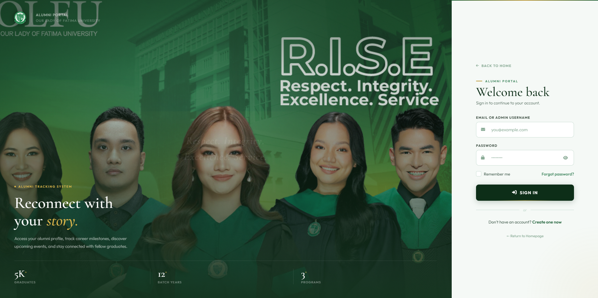
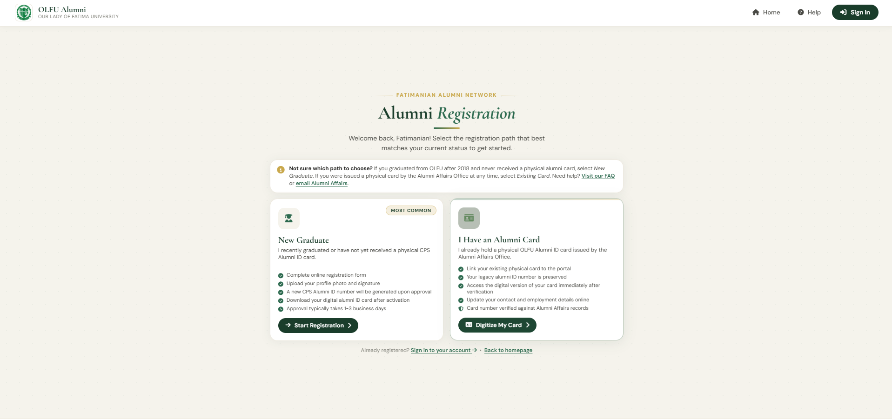
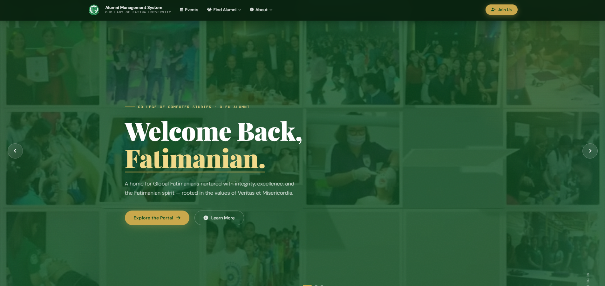
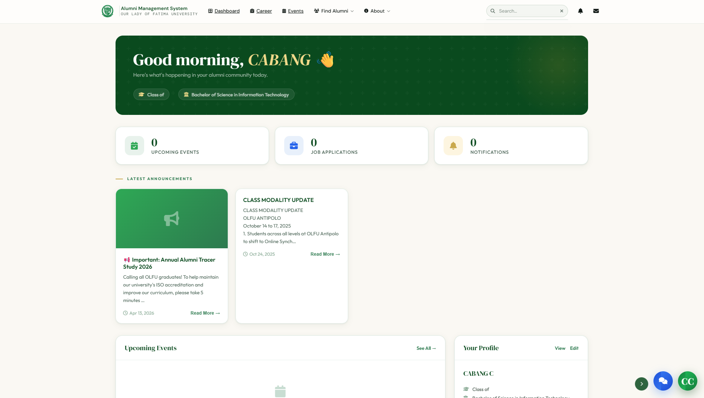
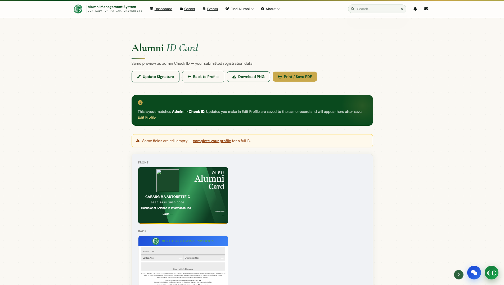
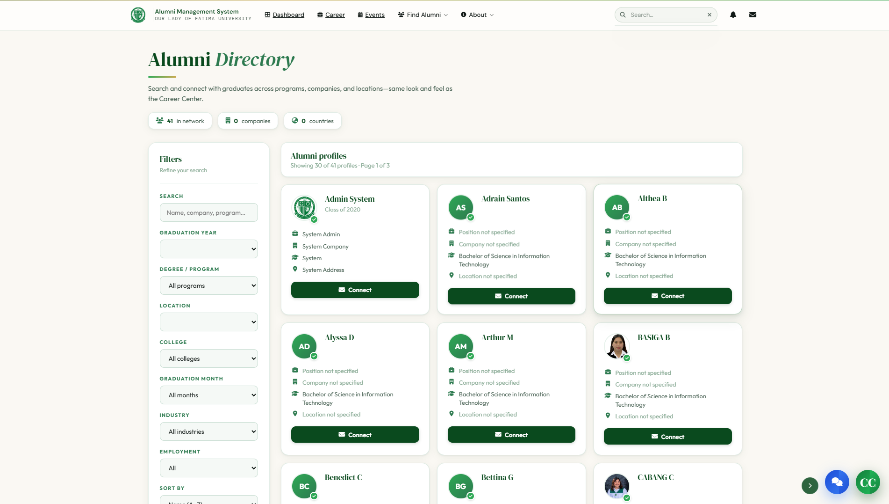
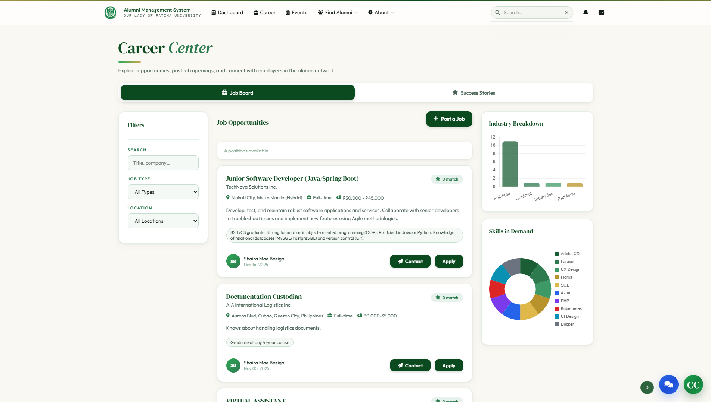

# OLFU Alumni Portal

A full-stack web application developed for Our Lady of Fatima University (OLFU) to manage alumni records, profile information, resume submissions, and alumni monitoring processes.

## Overview

The OLFU Alumni Portal was developed as a capstone project to provide a centralized platform for alumni data management. The system allows graduates to maintain updated profiles while enabling administrators to monitor alumni records efficiently.

## Features

* User authentication and secure login
* Alumni profile management
* Resume upload and storage
* Alumni record tracking
* Search and filtering functionality
* Responsive web interface
* Database-driven information management

## Tech Stack

### Frontend

* HTML
* CSS
* JavaScript

### Backend

* PHP

### Database

* MySQL

### Tools & Deployment

* XAMPP
* Hostinger
* GitHub

## System Architecture

```text
User Interface (HTML, CSS, JavaScript)
                │
                ▼
PHP Backend Application
                │
                ▼
MySQL Database
```

## Installation

### Clone the repository

```bash
git clone https://github.com/antonette37/olfu-alumni-portal.git
```

### Setup the project

1. Move the project folder to your XAMPP `htdocs` directory.
2. Start Apache and MySQL using XAMPP.
3. Import the database file into phpMyAdmin.
4. Configure database connection settings if needed.

### Run the application

Open your browser and navigate to:

```text
http://localhost/project-folder-name
```

## Project Highlights

* Developed as a university capstone project.
* Built a full-stack solution for alumni management and record tracking.
* Implemented user authentication and database integration.
* Applied REST API and JSON-based data handling concepts.
* Collaborated with team members using GitHub version control.
* Deployed the system for stakeholder testing and evaluation.

## Learning Outcomes

* Applied full-stack web development principles.
* Designed and managed relational database structures.
* Implemented backend functionality using PHP and MySQL.
* Practiced software testing and debugging workflows.
* Utilized GitHub for version control and team collaboration.

## Future Improvements

* Alumni employment analytics dashboard
* Email notification system
* Advanced reporting features
* Mobile application enhancement
* Role-based access control

## Screenshots

### Login Page


### Registration Page


### Home 


### Dashboard


### Alumni Card


### Alumni Directory


### Career Center


## Author

**Ma. Antonette C. Cabang**

Aspiring Full Stack Developer | Junior Software Developer

GitHub: https://github.com/antonette37
